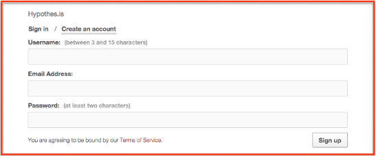

# Créez votre compte{#s1}
Allez à la [page d'inscription](https://hypothes.is/signup). Pour créer un compte Hypothesis, il vous suffit de disposer d'une adresse électronique et d'un nom d'utilisateur. Vous devriez recevoir un courriel de confirmation. Sinon, vérifiez votre boîte à spam.

Vous devez ensuite [installer hypothesis](#s2) dans votre navigateur.
