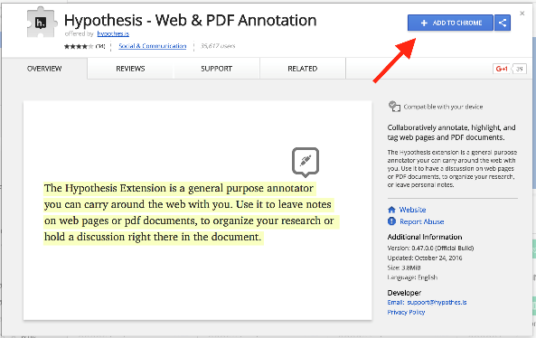

# Ajouter Hypothesis à votre navigateur{#s2}

Vous devez installer l'extension Chrome ou ajouter le marque-page à votre navigateur préféré. Vous avez trois possibilités :

* Vous utilisez Chrome, [installez l’extension](#s21)
* Vous utilisez un autre navigateur, [installez le signet](#s22)
* Ni l’un ni l’autre ne marche, [collez le lien sur via.hypothesis](#s23)

## Installer l’extension Chrome{#s21}

Lorsque vous utilisez Google Chrome, suivez [ce lien vers l'extension Hypothesis dans la boutique en ligne de Chrome](https://chrome.google.com/webstore/detail/hypothesis-web-pdf-annota/bjfhmglciegochdpefhhlphglcehbmek). Cliquez sur "**AJOUTER A CHROME**" :

## Installer le signet{#s22}
Pour ceux qui utilisent Firefox, Safari ou d'autres navigateurs, le signet fournit un moyen facile d'utiliser Hypothesis dans le navigateur de votre choix. (Rappel : Si votre navigateur préféré est Chrome, veuillez consulter ces instructions pour [installer l'extension Chrome](#s21)).

* Pour installer le signet Hypothesis, ouvrez le navigateur de votre choix et allez sur [web.hypothes.is/start/](https://web.hypothes.is/start/).
* Sur le côté droit, vous verrez un bouton "Hypothesis Bookmarklet".
* Glissez et déposez le bouton dans votre barre de signets, ou cliquez sur le bouton droit et sélectionnez "*bookmark this link*" dans le menu contextuel.

## Coller un lien sur via.hypothesis{#s23}
Cette option est à utiliser lorsque l'extension ou le signet ne fonctionne pas ou que vous n'avez pas la possibiité de les installer.

* Copiez le lien de la page à annoter
* Cliquez sur le lien [https://via.hypothes.is/](https://via.hypothes.is/)
* Collez votre lien et cliquez sur go. 

Note : Vous retrouverez ce lien sur n’importe que page du site [hypothesis](https://web.hypothes.is/) en cliquant en haut à droite sur [Paste a link](https://via.hypothes.is/).

