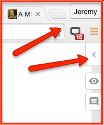

# Annoter un document{#s3}

Pour annoter un document, vous devez :

* Accédez à n'importe quelle page web (ou fichier PDF ou EPUB dans votre navigateur)
* Activez hypothesis en cliquant sur le bouton de l’extension (Chrome), le signet (autres navigateur) ou en collant le lien dans via hypothesis
* Ouvrez le volet hypothesis et si ce n’est pas encore fait, connectez-vous à votre compte.

* Sélectionnez du texte et annotez. Pour cela, vous devez saisir votre commentaire dans le champ texte. Vous disposez de quelques boutons de mise en forme et pouvez ajouter des liens, des images ou des formules mathématiques^[Les formules doivent respecter la syntaxe Latex. Si vous ne la connaissez pas, utilisez ce site pour écrire votre formule : <https://www.codecogs.com/latex/eqneditor.php> puis coller le code dans votre annotation entre deux symboles /$].
* Vous pouvez également ajouter des mots-clés en les saisissant dans le champ « Add tags »

Vous devez ensuite valider votre annotation. Pour cela cliquez sur le bouton noir sous les mots-clés, puis sélectionnez le mode de publication : privé (Post to me) ou public (Post to public). Si vous travaillez dans un groupe, vous pouvez également publier l’annotation pour le groupe. Le menu vous proposera alors une option Post to « *nom-du-groupe *». 

`r if (knitr::is_html_output()) '
)](img/img-5.gif)
'`
`r if (knitr::is_latex_output()) '
)](img/img-5.png)
'`
'`

## Conseils pour bien annoter{#s31}
Voici cinq bonnes pratiques à avoir en têtes lorsque vous annotez.

1. **Sélectionnez avec soin le texte pour vos annotations** Cela parait une évidence, mais il est bon de le rappeler et surtout de préciser ce que cela veut dire. Le choix de passages à annoter dépend principalement de l'objectif de votre lecture et de vos connaissances antérieures. Ce choix se portera sur les passages difficiles, ceux qui paraissent particulièrement important pour comprendre la progression du discours de l'auteur ou qui vont alimenter votre réflexion sur un sujet particulier. Dans tout les cas privilégiez la sélection d'un passage qui constitue une unité de sens. Lorsque vous exploiterez les annotations, il sera plus facile de renconnaitre de quoi il s'agit. Si un passage est déjà sélectionné, vous pouvez soit répondre à son annotation, soit sélectionner à nouveau le même texte. Vous pouvez également sélectionner un texte qui se trouve dans ou qui comporte une autre mise en évidence ou une autre annotation. Le choix n'est pas anodin à la fois pour la lisibilité des annotations, mais aussi pour la communication vers les autres usagers.

2. **Une annotation doit ajouter quelque chose au texte.** Les annotations servent la plupart du temps de support à l'analyse et pas simplement au résumé du texte. Elles sont la marque de votre travail de réflexion et d'apprentissage. L'annotation peut ainsi ajoter une définition, un lien vers un autre document, une autre idée. Ce peut également être un codage des différentes partie du texte ou du passage que vous annotez. Ce que vous ajouterez dépend bien sûr de l'objectif de votre lecture. Ainsi lors de la lecture du texte d'un cours, les annotations peuvent tout simplement être les questions à poser à l'enseignant. 

3. **Utiliser la mise en forme des annotations.** Lorsqu'on doit manipuler des textes longs, surtout s'ils sont enrichis d'annotations, utiliser des repères visuels peut s'avérer particulièment important. N'hésitez pas à faire usage des possiblités de mise en forme de vos annotations et d'utiliser les listes à puces pour facililter la lecture ultérieure.

4. **Utilisez des liens et des images.** Comme avec les possibilités de mise en forme, ces fonctionnalités sont particulièrement importantes pour aider à lexploration des annotations. Elles permettent en outre de faire des connexions avec d'autres documents et ainsi d'enrichir votre document.

5. **Utilisez des mots-clés**. Votre professeur peut vous demander d'utiliser des étiquettes pour diverses raisons. Un hashtag de cours peut être particulièrement utile car il génère un flux de contenu lié au tag sur le site Hypothesis. Cela vous permettra, à vous et à vos camarades de classe, de suivre plus facilement le travail des autres. Un enseignant peut vous demander d'identifier certains éléments textuels. Les mots-clés peuvent également être utiles pour vous même. pour faciliter la collecte d'arguments en faveur d'une thèse et des citations à utiliser dans un document final.

