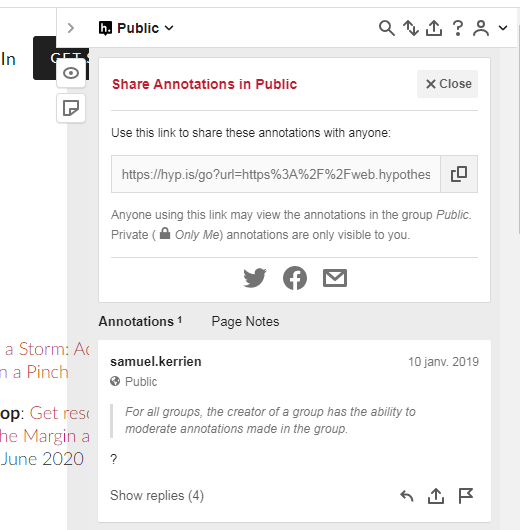

# Partager les annotations{#s4}

Chaque élément dans hypothesis possède sa propre URL et peut ainsi être partagé.

## Partager un fil d’annotation{#s41}

Vous pouvez partager toutes les annotations d’une page web ou d’un document. Pour cela ouvrez le volet d’annotation et cliquez sur l’icone  en haut à droite du volet. Vous aurez ainsi accès au lien de partage de la page qu’il vous suffira d’envoyer à votre correspondant.

## Partager une annotation{#s42}

Vous pouvez ne partager qu’une annotation ou une réponse à une annotation. Après l’avoir repérée dans le fil d’annotation (voir la [section 7](#s7)), cliquez sur le lien de partage sous l’annotation , puis comme précédemment copiez le lien et envoyez-le.

