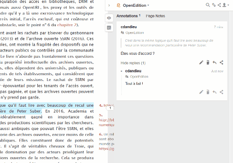

# Modification ou suppression d’une annotation{#s5}

Sous chaque annotation vous avez un bouton en forme de crayon vous permettant de modifier celle-ci et un autre en forme de poubelle pour la supprimer.

`r if (knitr::is_html_output()) '

'`

`r if (knitr::is_latex_output()) '

'`

Modifier ou supprimer une annotation (Source : [La maison des revues(2019)](http://www.maisondesrevues.org/1182))