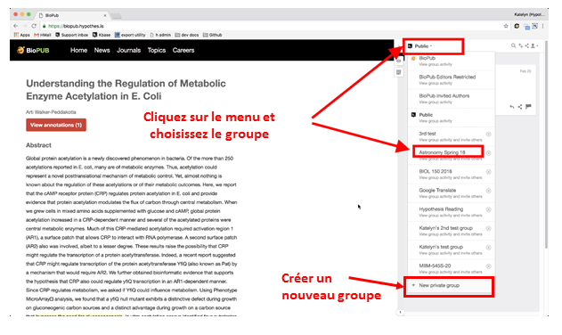
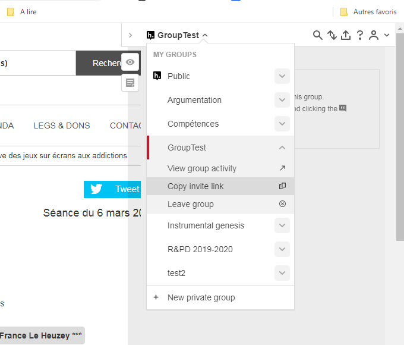
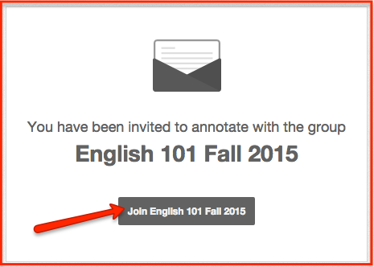
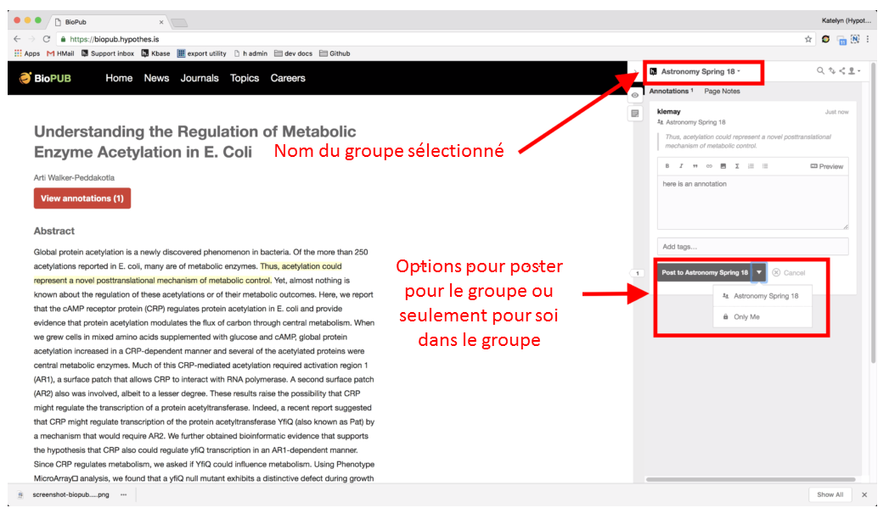

# Travailler en groupe avec hypothesis{#s6}

Sous hypothesis, un groupe est un ensemble de documents et d’annotations réservés aux seuls utilisateurs invités par le créateur du groupe.

## Créer à un groupe{#s61}

Pour créer un groupe, ouvrez le volet d’annotation puis déroulez le menu des groupes. Sélectionnez alors le groupe de votre choix ou cliquez sur *« New private group »* pour en créer un nouveau.

## Inviter d’autres personnes dans un groupe{#s62}

Pour inviter quelqu’un à rejoindre votre groupe, vous devez lui envoyer le lien de connexion.
*   Ouvrez le menu des groupes, puis repérez votre groupe.
*   Cliquez sur le chevron à droite du nom, puis cliquez sur *« Copy invite link »*
*   Envoyez ce lien à la personne que vous voulez inviter.

## Rejoindre un groupe{#s63}

Pour rejoindre un groupe, il faut qu'un membre vous invite en vous envoyant lien. Après vous être connecté à votre compte, cliquez sur le bouton pour faire partie du groupe.

## Annoter un document dans un groupe{#s64}

Lorsque vous annotez un document dans un groupe, vous pouvez faire des annotations uniquement pour vous-même en sélectionnant l’option « Only me » dans le bouton de validation ou pour tous les membres du groupe en sélectionnant le nom du groupe.

## Répondre à une annotation{#s65}

Dans un certain nombre de cas, vous pouvez avoir à répondre à une annotation. Dans ce cas, ouvrez le document sous hypothesis et cherchez l’annotation (voir [section 7](#s7), puis cliquez sur la flèche sous l’annotation à laquelle vous voulez répondre,  saisissez votre réponse et validez-la (Clic sur « Post to …)

`r if (knitr::is_html_output()) '
)](img/30f5eff1df71626cf0748cd0af596424.gif)

'`

`r if (knitr::is_latex_output()) '
)](img/30f5eff1df71626cf0748cd0af596424.png)

'`

Répondre à une annotation (Source : [La maison des revues(2019)](http://www.maisondesrevues.org/1182))
