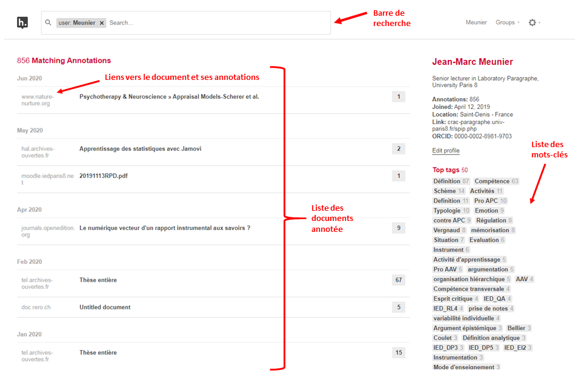

# Exploiter les annotations{#s7}
## Chercher une annotation{#s71}
Ouvrez le document sous hypothesis et cherchez l’annotation. Vous pouvez vous aider de l’outil de recherche (loupe) ou trier les annotations (bouton en forme de double flèche) en haut à droite du volet d’annotation

## Tableau de bord 
Chaque utilisateur dispose d'un tableau de bord dans lequel il peut retrouver les documents et les annotations qu'il a réalisé ou ceux de ses groupes. Pour ouvrir votre tableau de bord, cliquez sur l'icone de l'utilisateur en haut à droite du volet d'annotation et sélectionnez votre nom. 

Une barre de recherche vous permettra d'explorer vos documents. le tableau de bord  donne également la liste de documents que vous avez annoté ainsi qu'un lien vers chacun de ceux-ci. Vous y trouverez également la liste des mots-clés utilisés. En cliquant dessus, vous pouvez filtrer les documents concernés.

Hypothesis offre également la possibilité d'explorer les annotations publiques en allant sur la page dédiée [https://hypothes.is/search](https://hypothes.is/search)  
