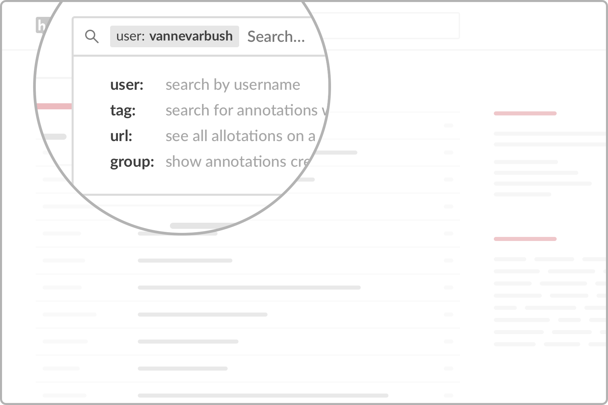

--- 
title: "Manuel utilisateur Hypothesis"
author: "Jean-Marc Meunier"
date: "`r Sys.Date()`"
bibliography:
- book.bib
- packages.bib
description: Ce manuel propose une synthèse en français des [tutoriels pour hypothesis](https://web.hypothes.is/help-categories/tutorials/).
  je l'ai rédigé pour les étudiants de l'institut d'enseignement à distance de l'université
  Paris 8. Il est mis à disposition sous licence creative commons NC-BY-SA.
documentclass: book
link-citations: yes
site: bookdown::bookdown_site
biblio-style: apalike
---

#  {-}

Ce manuel propose une synthèse en français des [tutoriels pour hypothesis](https://web.hypothes.is/help-categories/tutorials/). Je l'ai rédigé pour les étudiants de l'institut d'enseignement à distance de [l'université Paris 8](https://www.univ-paris8.fr/). Il est mis à disposition sous licence creative commons NC-BY-SA. 

Des remarques, des coquilles à signaler ? Utilisez [ce fil d'annotation](https://hyp.is/go?url=https%3A%2F%2Fjmeunierp8.github.io%2FGuide-utilisateur-Hypothesis%2F&group=__world__) pour les signaler. 

## A quoi ça sert ? {-}

[Hypothesis](https://web.hypothes.is/) fournit un ensemble de composants qui fonctionnent ensemble pour permettre un large éventail d'applications basées sur l'annotation. ces composants sont : 

* Un visualiseur et un éditeur d'annotations qui s'exécutent en superposition au document dans un navigateur soit grâce à une extension pour le navigateur Google Chrome,  soit à l'aide d'un marque-page (bookmarklet).
* Un service qui stocke, recherche et affiche les annotations, gère les utilisateurs et les groupes, et fournit le client dans des pages qui ont été annotées.

* Une fois hypothesis installé, il suffit de sélectionnez le texte à annoter puis d'ajouter vos commentaires ou des mot-clés (tags) avant de publier publiquement ou non vos annotations. 
* Vous pouvez partager vos annotations à l'aide d'un lien vers une annotation ou une page. vous pouvez également répondre à toute annotation.
* Hypothesis permet aussi collaborer en privé avec d'autres personnes en créant un groupe et en partageant vos annotations dans celui-ci. 
* Enfin, vous pouvez explorez toutes les annotations publiques et les profils.

Voici quelques ressources en anglais pour vous faire une idée des possibilités offertes par Hypothesis :

### Pour les enseignants{-}

* Voyez ce que les [enseignants](https://web.hypothes.is/teacher-testimonials/) et les [étudiants](https://web.hypothes.is/student-testimonials/) disent du l'intérêt de l'annotation collaborative
* Explorer des [exemples d'utilisation en classe](https://web.hypothes.is/examples-of-classroom-use/)
* [10 façons d'annoter avec les étudiants](https://web.hypothes.is/blog/back-to-school-with-annotation-10-ways-to-annotate-with-students/)
* [Guide pour les enseignants](https://web.hypothes.is/teacher-resource-guide/)

### Pour les étudiants{-}
* [Conseils d'annotation pour les étudiants](https://web.hypothes.is/annotation-tips-for-students/)
* [Guide pour les étudiants](https://web.hypothes.is/student-resource-guide/)

